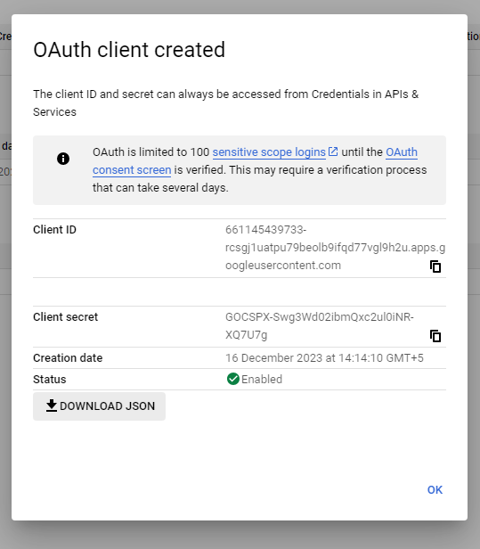

# Steps to implement OAuth

---

1. ### register your application with google.
    1. open google cloud console click `API and Services` -> `Credentials`
    2. Configure OAuth Screen
    3. select External click on `Create`
    4. give the basic required details.
    5. select `Scopes` based on what you select the google will give your web app that info which come's under scopes
    6. Your app starts off with testing mode so go back to the dashboard andnn clik publish app.
    7. go back to Credentials and click on `+ CREATE CREDENTIALS` -> `Create OAuth Client ID`
    8. need to give your URI's javascript and redirect URI's if you have same frontend and backend give that
    ```
    for the front-end to handle
    https://localhost:3000
    ```
    ```
    for the backend to handle redirect from google
    https://localhost:3000/auth/google/callback
    ```
    9. now you have to write the code in the backend that handle's the client secrect key

2. ### after following all the above step google will now give you the follwing key
    1. 

3. ### now we have to write the logic that handle's callback that we get from the google when the user try's to login in our server

    we define our required routes

    ```javascript
    const passport = require('passport');

    const config = {
        CLIENT_ID: process.env.CLIENT_ID,
        CLIENT_SECRET: process.env.CLIENT_SECRET
    };

    const AUTH_OPTIONS = {
    clientID: config.CLIENT_ID,
    clientSecret: config.CLIENT_SECRET,
    callbackURL: "/auth/google/callback",
    };

    function verifyCallback( accessToken, refreshToken, profile, done ){
        // you can add that user to your db or stuff like that here
        console.log( 'Google Profile', profile );
        done( null, profile );
    }

    passport.use( new Strategy(AUTH_OPTIONS, verifyCallback ));
    ```

    after setting up our passport we add it to our middleware chain

    ```javascript
    app.use( passport.initialize() );

    // NOW WE SETUP OUR ROUTES
    // we can pass middleware for a specific route this is how we handle authorization in express

    app.get(
        // will start the enire google flow
            "/auth/google",
            // PASSPORT HAS A MIDDLEWARE TO HANDLE THIS
            passport.authenticate( 'google', {
                scope: [ 'email', 'profile' ]
            }),
            (req, res) => {

                console.log( 'kicked off the google OAuth flow')
            }
    );

    app.get( '/auth/google/callback', 
            // PASSPORT AUTHENTICATOR MIDDLEWARE
            passport.authenticate('google',
            {
                failureRedirect: '/failure',
                successRedirect: '/',
                session: false,
            }), 
            ( req, res) => {
                console.log( 'google called us back')
    });
    ```

    response we get back
    ```bash
    Google Profile {
    id: '113922755586795322573',
    displayName: 'M saqlaen Ahmed',
    name: { familyName: 'Ahmed', givenName: 'M saqlaen' },
    emails: [ { value: 'msaqlaenahmed98@gmail.com', verified: true } ],
    photos: [
        {
        value: 'https://lh3.googleusercontent.com/a/ACg8ocKhGaw9jEhiEKxayEmIL1-YURTcvNyp9Wc2t3ZDATSdLSU=s96-c'
        }
    ],
    provider: 'google',
    _raw: '{\n' +
        '  "sub": "113922755586795322573",\n' +
        '  "name": "M saqlaen Ahmed",\n' +
        '  "given_name": "M saqlaen",\n' +
        '  "family_name": "Ahmed",\n' +
        '  "picture": "https://lh3.googleusercontent.com/a/ACg8ocKhGaw9jEhiEKxayEmIL1-YURTcvNyp9Wc2t3ZDATSdLSU\\u003ds96-c",\n' +
        '  "email": "msaqlaenahmed98@gmail.com",\n' +
        '  "email_verified": true,\n' +
        '  "locale": "en-GB"\n' +
        '}',
    _json: {
        sub: '113922755586795322573',
        name: 'M saqlaen Ahmed',
        given_name: 'M saqlaen',
        family_name: 'Ahmed',
        picture: 'https://lh3.googleusercontent.com/a/ACg8ocKhGaw9jEhiEKxayEmIL1-YURTcvNyp9Wc2t3ZDATSdLSU=s96-c',
        email: 'msaqlaenahmed98@gmail.com',
        email_verified: true,
        locale: 'en-GB'
    }
    }
    ```
